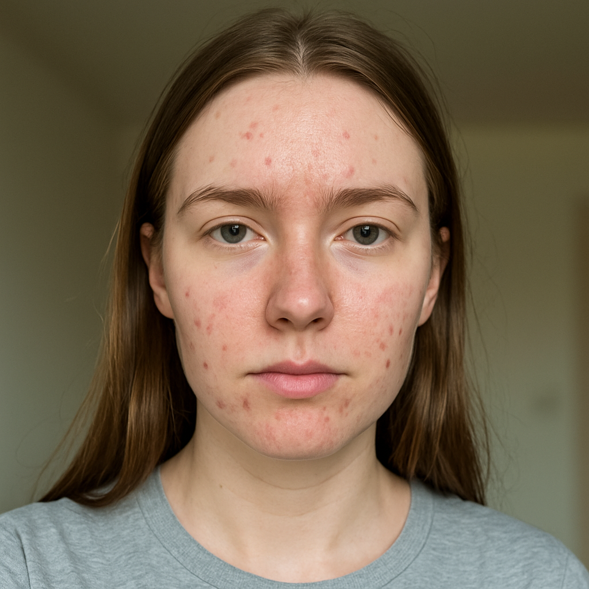
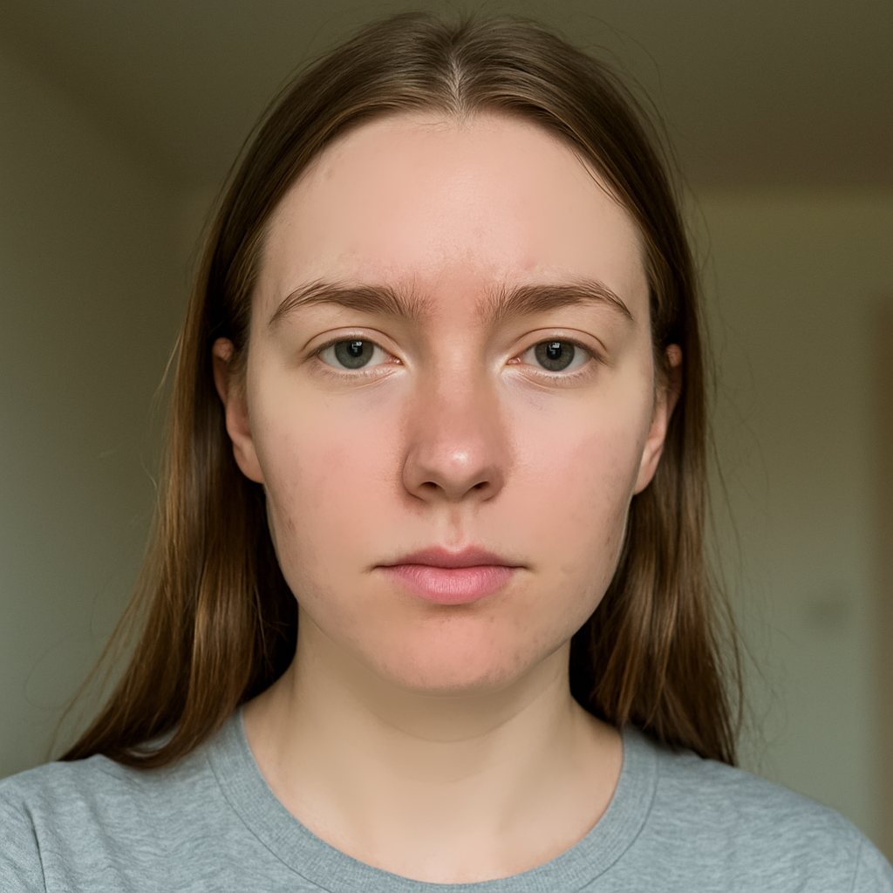
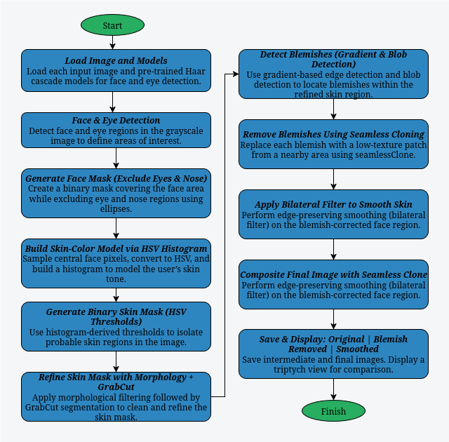

# Skin Smoothing & Automatic Blemish Removal

This tool performs automatic skin smoothing and blemish removal on facial images using OpenCV. It leverages facial feature detection, skin color modeling, blob detection, and seamless cloning to produce natural-looking, retouched images.

---

## Example Outputs

<div style="display: flex; justify-content: center; overflow-x: auto; width: 80%;">
  <table style="table-layout: auto; border-collapse: collapse;">
    <thead>
      <tr>
        <th style="text-align: left; padding: 8px;">Original Image</th>
        <th style="text-align: left; padding: 8px;">After Blemish Removal</th>
        <th style="text-align: left; padding: 8px;">Final Smoothed Result</th>
      </tr>
    </thead>
    <tbody>
      <tr>
        <td style="padding: 8px;">
          
        </td>
        <td style="padding: 8px;">
          
        </td>
        <td style="padding: 8px;">
          
        </td>
      </tr>
    </tbody>
  </table>
</div>

---

## What It Does

* Detects faces and eyes using Haar cascade classifiers.
* Constructs a skin-color model from the detected face region using HSV histograms.
* Generates and refines a binary skin mask using thresholding, morphological operations, and GrabCut segmentation.
* Identifies blemishes through gradient and blob analysis within the skin region.
* Removes blemishes by replacing them with low-texture patches via seamless cloning.
* Applies a bilateral filter to the cleaned face region to achieve natural skin smoothing.
* Composites the final result and saves both intermediate and final outputs for comparison.

---

## Build & Run Instructions

Clone the repository and build all projects in one step:

```bash
git clone https://github.com/sancho11/skin_smoothing.git
cd skin_smoothing
mkdir build && cd build
cmake ..
make
```

Executable will be placed in the bin directory `build/bin/skin_smoothing`.

To run the project:

```bash
./bin/skin_smoothing
```

---

## Pipeline Overview

<p align="center">
  
  <br><em>Pipeline Diagram</em>
</p>

---

## Key Concepts

This project automates skin smoothing and blemish removal using advanced techniques in image processing and computer vision. Below are the core concepts behind the pipeline:

* Face & Eye Detection
   Uses pre-trained Haar cascade classifiers to locate the face and eyes within an image, allowing for precise region-of-interest selection and feature-aware masking.

* Semantic Face Masking
   A custom face mask is generated to define the smoothing region. This mask includes the face but excludes high-detail features like eyes and nose, preserving facial integrity.

* Skin Color Modeling (HSV Space)
   Builds a personalized skin color profile by sampling the central facial region. A histogram in HSV color space is used to estimate the distribution of skin tones dynamically.

* Adaptive Skin Segmentation
   Generates a binary mask of skin pixels using HSV thresholding, then refines it using morphological operations and GrabCut segmentation for higher accuracy.

* Blemish Detection via Texture Analysis
   Identifies blemishes by combining gradient magnitude analysis with blob detection. This highlights circular, high-frequency regions (blemishes) within the smooth skin mask.

* Texture-Aware Blemish Removal
   Each detected blemish is replaced with a low-texture patch from nearby areas. Patches are seamlessly cloned to preserve skin tone and lighting continuity.

* Bilateral Smoothing
   Applies edge-preserving smoothing using a bilateral filter. This reduces uneven skin texture without blurring facial features or contours.

* Seamless Image Composition
   The smoothed and corrected region is blended back into the original image using seamless cloning, ensuring a natural and artifact-free appearance.